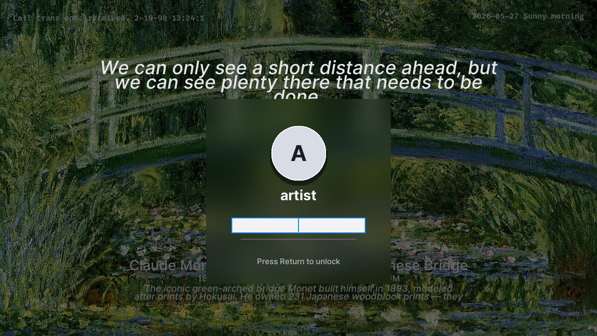

# Art Locker

<p align="center">
  <strong>An art-first lock screen for Linux/XFCE multi-monitor desktops.</strong>
</p>

<p align="center">
  
  
  
  
</p>

<p align="center">
  
</p>

Art Locker turns the idle lock screen into a quiet gallery moment: artwork
across every monitor, a focused macOS-inspired acrylic login prompt, and strict
startup checks so unreliable monitor states fail cleanly.

> [!WARNING]
> Art Locker is alpha software. Test it with a recovery path available, such as
> SSH, TTY access, or a physical console. Do not make it your only lock screen
> until your fullscreen and sleep/wake flows are proven stable.

## Highlights

- Multi-monitor fullscreen lock windows for X11 desktops.
- Centered login card with avatar, user name, and single password field.
- Artwork from custom directories, static assets, or a curator script.
- Startup guardrails for X11 readiness and monitor geometry.
- Hard failure if global keyboard/pointer grab cannot be acquired.
- Single-instance lockfile to avoid duplicate lockers.
- Killswitch for emergency recovery.
- Local diagnostic logging.
- Disabled-by-default `xautolock` autostart example.

## Screenshots

| Gallery State | Login State |
| --- | --- |
|  |  |

## How It Works

Art Locker starts by validating that X11 is reachable and that `xrandr`
reports a sane monitor layout. It then creates one fullscreen Tk window per
monitor. The primary monitor gets the quote, artwork metadata, and login card;
side monitors get simplified artwork signatures.

When the user interacts with the lock screen, the UI transitions from gallery
mode to authentication mode. Password validation uses PAM through `pamela`
without calling `pam_setcred`, avoiding a common user-space locker failure mode
on some distributions.

## Requirements

- Linux with X11
- XFCE or another X11 desktop with `xrandr`
- Python 3
- Pillow
- pamela
- `xdpyinfo`
- `xautolock`, only if you want idle activation

Debian/Ubuntu-style packages:

```bash
sudo apt install x11-xserver-utils x11-utils xautolock python3-pil python3-pamela
```

Python packages:

```bash
python3 -m pip install --user Pillow pamela
```

## Quick Start

Clone and validate the environment:

```bash
git clone https://github.com/juliosuas/art-locker.git
cd art-locker
./art-locker --check
```

Expected:

```text
OK display ready; monitors=3; artwork=/path/to/artwork.jpg
```

Run the safe preview:

```bash
./art-locker --preview
```

Preview mode opens a normal window. It does not grab input and does not
authenticate. Press any key or move the pointer inside the preview to reveal
the login card.

## Artwork Sources

Art Locker can use artwork from several places:

- `ART_LOCKER_ART_DIRS`: colon-separated list of local directories.
- `ART_LOCKER_STATIC_DIR`: directory for static fallback artwork.
- `ART_LOCKER_CURATOR`: optional script that returns JSON curator data.

Example:

```bash
export ART_LOCKER_ART_DIRS="$HOME/Pictures/art:$HOME/Pictures/wallpapers"
./art-locker --check
```

Supported local image extensions:

- `.jpg`
- `.jpeg`
- `.png`
- `.webp`

The current code also keeps compatibility with an existing `monet-walls`
curator if one is present locally, but Art Locker itself is not Monet-specific.

## Fullscreen Test

Before testing fullscreen, keep a recovery command ready from another terminal
or SSH session:

```bash
touch /tmp/art-locker-killswitch
```

Then run:

```bash
./art-locker
```

If anything goes wrong, create the killswitch file. Art Locker polls for it and
exits.

## Idle Activation

Idle activation is intentionally disabled by default. The example file lives at:

```text
examples/art-idle.desktop
```

Install it locally while keeping it disabled:

```bash
./scripts/install-local-disabled.sh
```

Only after fullscreen testing is stable, edit the installed autostart file and
change:

```ini
Hidden=false
X-GNOME-Autostart-enabled=true
```

## Safety Model

Art Locker tries to avoid the failure modes that make custom lock screens scary:

- It refuses to start if X11 is unavailable.
- It samples monitor geometry more than once before using it.
- It aborts if no usable monitor layout exists.
- It aborts if global grab fails.
- It writes a process lockfile to prevent duplicate lockers.
- It exposes a killswitch file for recovery.
- It logs to `~/.local/share/art-locker/locker.log`.

These checks improve safety, but they are not a formal security guarantee.

## Known Risks

- Tk/X11 fullscreen behavior varies by compositor and window manager.
- DPMS sleep/wake can temporarily report unstable monitor geometry.
- PAM stacks differ across distributions.
- Wayland is not supported yet.
- Accessibility and keyboard-only flows need review.

## Roadmap

- Harden DPMS sleep/wake behavior.
- Add a dedicated config file.
- Add deterministic artwork selection.
- Add CI linting and packaging checks.
- Improve accessibility and font fallback.
- Explore Wayland-compatible architecture.
- Package for Debian-style systems.

## Contributing

Bug reports are most useful when they include:

- distro and version
- desktop environment and window manager
- X11 vs Wayland
- GPU and driver
- output of `xrandr --listmonitors`
- relevant DPMS section from `xset q`
- whether lock, blank, sleep, wake, and unlock worked
- screenshot if geometry or UI is wrong
- relevant `~/.local/share/art-locker/locker.log` lines

The first tracking issue is:

https://github.com/juliosuas/art-locker/issues/1

## License

MIT
